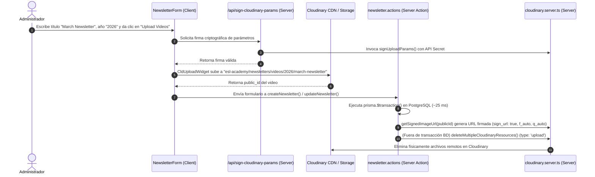

# Arquitectura e Implementación: Flujo de Vocabulary Sets y Cloudinary

> **Estado del Módulo**: 🟢 Producción (Entrega Firmada, Transformaciones CDN, Inicialización Perezosa y Carga On-Demand por Año/Newsletter)  
> **Última Actualización**: 2026-08-23  
> **Proyecto**: ESL Academy (Miss Kelly)  

Este documento detalla los fundamentos técnicos, decisiones de diseño (ADRs), modelo de datos, seguridad criptográfica, optimización CDN y el estado de producción de la carga y gestión multimedia en boletines (*newsletters*).

---

## 1. Contexto y Objetivos

### Objetivos Principales
- **Transición de URLs Públicas a URLs Firmadas en Servidor**: Reemplazar las URLs estáticas/públicas por enlaces criptográficamente firmados (`sign_url: true`, `secure: true`), garantizando que la entrega de recursos multimedia esté protegida por firmas generadas en el servidor (`CLOUDINARY_API_SECRET`).
- **Optimización CDN y Caché Global**: Aplicar transformaciones automáticas al vuelo (`f_auto`, `q_auto`, `crop: 'limit'`) y entregar imágenes/videos directamente desde el Edge CDN de Cloudinary con `unoptimized` en Next.js, eliminando el re-procesamiento redundante de CPU en Vercel.
- **Carga Directa e Instantánea**: Permitir a los administradores subir multimedia desde el navegador a Cloudinary usando widgets firmados server-side (`/api/sign-cloudinary-params`) con el preset `ms_kelly_signed`.
- **Estructura Organizada en CDN**: Almacenar los recursos multimedia organizados dinámicamente por carpetas según el año, título del newsletter y nombre del set de vocabulario:
  - **Videos**: `esl-academy/newsletters/videos/<año>/<slug-del-newsletter>/`
  - **Vocabulario**: `esl-academy/newsletters/vocabulary/<año>/<slug-del-newsletter>/<slug-del-set>/`
- **Ciclo de Vida Limpio y Transacciones Rápidas**: Garantizar la eliminación atómica y limpia de recursos en Cloudinary fuera de las transacciones SQL de Prisma, evitando bloqueos y timeouts de base de datos (`P2028`).

---

## 2. Decisiones de Arquitectura Justificadas (ADR)

### 2.1 Transición a URLs Firmadas y Transformaciones CDN (`getSignedImageUrl` / `getSignedVideoUrl`)
- **Decisión**: Generar todas las URLs de entrega desde `cloudinary.server.ts` con firma de servidor (`sign_url: true`, `secure: true`) e incluir transformaciones automáticas de calidad y formato (`f_auto`, `q_auto`, `crop: 'limit'`).
- **¿Por qué?**:
  1. **Seguridad**: Previene la manipulación o acceso no autorizado a los assets.
  2. **Rendimiento**: Cloudinary convierte automáticamente las imágenes a formatos modernos (WebP/AVIF) y optimiza el peso según el dispositivo del cliente.
  3. **Generación de PDFs**: Las utilidades de exportación PDF (`newsletter-pdf.utils.ts`) consumen directamente las URLs firmadas de servidor sin requerir transformaciones manuales ni ensambles de strings en el cliente.

### 2.2 Carga On-Demand con Widgets Activos (`activeUploadSet` / `isUploadingVideo`)
- **Decisión**: Encapsular el montaje de `<CldUploadWidget />` para que se instancie dinámicamente bajo demanda únicamente cuando el usuario hace clic en *"Upload Images"* o *"Upload Videos"*, deshabilitando los botones si el título está vacío (`disabled={!title.trim()}`).
- **¿Por qué?**:
  1. Evita la creación de carpetas temporales o genéricas (como `unnamed-set` o `/general`).
  2. Garantiza que la carpeta de destino en Cloudinary contenga el año y nombre real del boletín y del set de vocabulario.

### 2.3 Apertura Controlada de Única Ejecución (`AutoOpenUploadWidget`)
- **Decisión**: Encapsular la llamada `open()` del widget en un componente helper con `useRef(false)`.
- **¿Por qué?**:
  1. Previene excepciones `TypeError: open is not a function` esperando a que el script asíncrono termine de cargar (`!isLoading`).
  2. Evita bucles infinitos de re-apertura del modal cuando `addVocabularyImage` actualiza el estado de React al subir imágenes concurrentes (`multiple: true`).

### 2.4 Formulario Transaccional y Preservación de Assets
- **Decisión**: No realizar llamadas destructivas a Cloudinary durante la edición en React; ejecutar la limpieza de huérfanos (`orphanedImages`, `orphanedVideos`) únicamente en la Server Action `updateNewsletter` al presionar *"Guardar"*.
- **¿Por qué?**: Garantiza que si el usuario presiona *"Cancelar"*, la base de datos y los archivos en Cloudinary permanezcan intactos sin romper referencias.

### 2.5 Firma Server-Side para Presets Firmados (`/api/sign-cloudinary-params`)
- **Decisión**: Implementar el endpoint [`/api/sign-cloudinary-params`](file:///d:/repositorios/typeScript/antigravity_agent/academy-kelly/src/app/api/sign-cloudinary-params/route.ts) usando `signUploadParams` con `CLOUDINARY_API_SECRET`.
- **¿Por qué?**: El preset `ms_kelly_signed` en Cloudinary está configurado como `Mode: Signed`. Este flujo permite autorizaciones de subida criptográficas directas desde el cliente sin exponer el secreto API en el navegador.

### 2.6 Inicialización Perezosa (Lazy Initialization) de Cloudinary SDK (`getCloudinary()`)
- **Decisión**: Encapsular `cloudinary.config()` dentro del helper `getCloudinary()` en [`cloudinary.server.ts`](file:///d:/repositorios/typeScript/antigravity_agent/academy-kelly/src/lib/cloudinary.server.ts), eliminando la llamada en la raíz del módulo y removiendo el archivo re-exportador obsoleto `cloudinary.ts`.
- **¿Por qué?**:
  1. Cuando Next.js App Router empaqueta Server Actions importadas por componentes de cliente (`'use client'`), evalúa los módulos en tiempo de bundling.
  2. Ejecutar `cloudinary.config()` a nivel raíz provocaba que Webpack evaluara el método sobre un proxy no inicializado, lanzando `TypeError: i.config is not a function`.
  3. Con `getCloudinary()`, `cloudinary.config()` solo se ejecuta en runtime al invocar operaciones de imágenes/videos.

### 2.7 Borrado por Catálogo de Entrega `type: 'upload'` en Eliminación Masiva
- **Decisión**: Configurar `deleteMultipleCloudinaryResources` con `type: 'upload'` en lugar de `type: 'authenticated'`.
- **¿Por qué?**:
  1. Los recursos subidos directamente desde el cliente con el widget y preset firmado se registran bajo el catálogo `type: 'upload'` (Delivery type: Upload).
  2. Al especificar `type: 'upload'`, la API `cld.api.delete_resources` de Cloudinary localiza las imágenes/videos y los borra permanentemente al eliminar un newsletter o set.

### 2.8 Entrega Directa desde CDN con `unoptimized` y Configuración RemotePatterns
- **Decisión**: Configurar `res.cloudinary.com` en [`next.config.ts`](file:///d:/repositorios/typeScript/antigravity_agent/academy-kelly/next.config.ts) sin restricción `search: ''` y utilizar `unoptimized` en [`CloudinaryImage.tsx`](file:///d:/repositorios/typeScript/antigravity_agent/academy-kelly/src/components/platform/CloudinaryImage.tsx) para URLs absolutas firmadas.
- **¿Por qué?**:
  1. Elimina el error de Next.js `"url" parameter is not allowed` provocado por parámetros de consulta o firma (`?_a=...`).
  2. Sirve los archivos directamente desde el CDN global de Cloudinary aprovechando sus optimizaciones nativas (`f_auto`, `q_auto`, WebP/AVIF) sin consumo adicional de CPU en Next.js.

### 2.9 Desacoplamiento de Red en Server Actions (Solución a Timeout P2028)
- **Decisión**: Mover las llamadas HTTP a Cloudinary (`deleteCloudinaryResources`) **fuera** del bloque `prisma.$transaction(...)` en `deleteNewsletter` y `updateNewsletter`.
- **¿Por qué?**:
  1. Las transacciones interactivas de Prisma tienen un límite de espera estricto de 5000 ms. Realizar peticiones por red a Cloudinary dentro de la transacción provocaba el error `P2028 (Transaction API error: Transaction already closed)`.
  2. Al ejecutarse después de confirmar en PostgreSQL (~25 ms), la base de datos responde de inmediato y la eliminación remota se completa limpia.

---

## 3. Modelo de Datos y Esquema Prisma

```prisma
model Newsletter {
  id             String          @id @default(uuid())
  title          String
  description    String?
  slug           String          @unique
  levelId        String
  level          Level           @relation(fields: [levelId], references: [id])
  vocabularySets VocabularySet[]
  videos         Video[]
  createdAt      DateTime        @default(now())
  updatedAt      DateTime        @updatedAt
}

model VocabularySet {
  id           String            @id @default(uuid())
  name         String
  newsletterId String
  newsletter   Newsletter        @relation(fields: [newsletterId], references: [id], onDelete: Cascade)
  images       VocabularyImage[]
  order        Int               @default(0)
}

model VocabularyImage {
  id        String        @id @default(uuid())
  imageUrl  String        // Almacena el public_id de Cloudinary o URL completa
  fileName  String?
  setId     String
  set       VocabularySet @relation(fields: [setId], references: [id], onDelete: Cascade)
  order     Int           @default(0)
}
```

---

## 4. Diagrama de Arquitectura de la Solución



---

## 5. Estructura de Componentes y Funcionalidades

### 5.1 Utilidades e Infraestructura Servidor
- **[`src/lib/cloudinary.server.ts`](file:///d:/repositorios/typeScript/antigravity_agent/academy-kelly/src/lib/cloudinary.server.ts)**: Servidor de integración centralizado. Contiene `getSignedImageUrl`, `getSignedVideoUrl`, `deleteMultipleCloudinaryResources`, `uploadProtectedResource` y `signUploadParams`.
- **[`src/utils/cloudinary.utils.ts`](file:///d:/repositorios/typeScript/antigravity_agent/academy-kelly/src/utils/cloudinary.utils.ts)**: Utilidades de cliente para detección de URLs completas (`isFullUrl`) y formateo auxiliar.
- **[`src/utils/newsletter-pdf.utils.ts`](file:///d:/repositorios/typeScript/antigravity_agent/academy-kelly/src/utils/newsletter-pdf.utils.ts)**: Generador de PDFs optimizado que consume directamente las URLs de servidor firmadas.

### 5.2 Capa de Negocio / Server Actions
- **[`src/actions/newsletters/newsletter.actions.ts`](file:///d:/repositorios/typeScript/antigravity_agent/academy-kelly/src/actions/newsletters/newsletter.actions.ts)**:
  - `createNewsletter`: Procesa relaciones y persiste en base de datos.
  - `updateNewsletter`: Identifica diferencias entre `public_id`s viejos y nuevos (`orphanedImages`, `orphanedVideos`) y ejecuta la limpieza remota fuera de la transacción SQL.
  - `deleteNewsletter`: Recopila todos los `public_id`s del boletín, ejecuta la eliminación en BD y posteriormente la eliminación atómica remota en Cloudinary.

### 5.3 Componentes de Interfaz / Presentación
- **[`src/components/platform/admin/newsletters/NewsletterForm.tsx`](file:///d:/repositorios/typeScript/antigravity_agent/academy-kelly/src/components/platform/admin/newsletters/NewsletterForm.tsx)**: Formulario interactivo con carga dinámicamente instanciada (On-Demand) de `<CldUploadWidget />` tanto para conjuntos de vocabulario como para videos, estructurando las rutas por año y título de newsletter.
- **[`src/components/platform/CloudinaryImage.tsx`](file:///d:/repositorios/typeScript/antigravity_agent/academy-kelly/src/components/platform/CloudinaryImage.tsx)**: Componente inteligente que decide entre `<Image unoptimized />` (para URLs firmadas) y `<CldImage />` (para public_ids).

---

## 6. Seguridad y Manejo de Errores

- **Firma Criptográfica**: Las credenciales privadas (`CLOUDINARY_API_SECRET`) residen únicamente en variables de entorno del servidor. Todas las URLs generadas incluyen firma de servidor (`sign_url: true`).
- **Sanitización de Rutas**: Todas las rutas de carpetas se normalizan con `slugify` para evitar inyecciones de caracteres no válidos.
- **Tratamiento de Errores**: La inicialización perezosa y la separación de transacciones reducen a cero las excepciones de Webpack y los timeouts de base de datos.

---

## 7. Inventario de Archivos y Rutas

| Archivo / Ruta | Tipo | Descripción |
| :--- | :--- | :--- |
| [`src/lib/cloudinary.server.ts`](file:///d:/repositorios/typeScript/antigravity_agent/academy-kelly/src/lib/cloudinary.server.ts) | Servidor / Helper | SDK de Cloudinary con inicialización perezosa `getCloudinary()` y firmas `sign_url: true`. |
| [`src/app/api/sign-cloudinary-params/route.ts`](file:///d:/repositorios/typeScript/antigravity_agent/academy-kelly/src/app/api/sign-cloudinary-params/route.ts) | API Route | Endpoint para firmar parámetros del widget del cliente. |
| [`src/actions/newsletters/newsletter.actions.ts`](file:///d:/repositorios/typeScript/antigravity_agent/academy-kelly/src/actions/newsletters/newsletter.actions.ts) | Server Actions | Operaciones CRUD y eliminación de huérfanos fuera de la transacción SQL. |
| [`src/components/platform/admin/newsletters/NewsletterForm.tsx`](file:///d:/repositorios/typeScript/antigravity_agent/academy-kelly/src/components/platform/admin/newsletters/NewsletterForm.tsx) | Client UI | Formulario de boletines con carga On-Demand para vocabulario y videos por año y título. |
| [`src/components/platform/CloudinaryImage.tsx`](file:///d:/repositorios/typeScript/antigravity_agent/academy-kelly/src/components/platform/CloudinaryImage.tsx) | Client UI | Renderizado optimizado de imágenes sin sobre-procesar en Next.js (`unoptimized`). |
| [`src/utils/newsletter-pdf.utils.ts`](file:///d:/repositorios/typeScript/antigravity_agent/academy-kelly/src/utils/newsletter-pdf.utils.ts) | Utilidad | Exportación a PDF consumiendo URLs de servidor firmadas. |
| [`next.config.ts`](file:///d:/repositorios/typeScript/antigravity_agent/academy-kelly/next.config.ts) | Configuración | Configuración de `remotePatterns` para dominios de imágenes. |

---

## 8. Historial de Revisiones (Changelog)

| Fecha | Estado del Módulo | Cambios Principales |
| :--- | :--- | :--- |
| 2026-08-22 | 🟡 MVP | Implementación inicial de widgets de carga y estructura de boletines. |
| 2026-08-23 | 🟢 Producción | Migración completa a **URLs Criptográficamente Firmadas** (`sign_url: true`, `secure: true`), optimizaciones de caché CDN y transformaciones automáticas (`f_auto`, `q_auto`, `crop: 'limit'`), endpoint de firmas `/api/sign-cloudinary-params`, inicialización perezosa `getCloudinary()`, eliminación masiva con `type: 'upload'`, carpetas On-Demand por año/título y solución al timeout Prisma `P2028`. |
