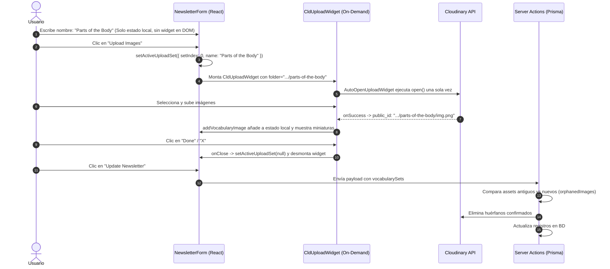

# Arquitectura y Decisiones de Diseño: Flujo de Vocabulary Sets y Cloudinary

Este documento registra los antecedentes, problemas encontrados y las razones técnicas detrás de las decisiones tomadas en la implementación del flujo de carga de imágenes para **Vocabulary Sets** y la gestión de assets en **Cloudinary**.

---

## 1. Contexto y Problemas Iniciales

La aplicación permite a los administradores crear y editar boletines (*newsletters*) que contienen múltiples conjuntos de vocabulario (`VocabularySet`). Cada conjunto tiene un nombre y contiene una serie de imágenes (`VocabularyImage`).

La estructura deseada en Cloudinary es:
```text
esl-academy/
  newsletters/
    vocabulary/
      <slug-del-nombre-del-set>/
        image1
        image2
```

### Problemas Detectados

1. **Imágenes en `unnamed-set`**:
   Originalmente, el componente `<CldUploadWidget>` se montaba incondicionalmente en cada fila del set desde el inicio (`name = ""`), capturando el valor por defecto `unnamed-set` en la inicialización interna del widget.

2. **Captura prematura de la primera letra (`.../f/`) y saltos visuales**:
   Al intentar resolverlo con renderizado condicional simple o keys dinámicas (`key={`${set.id}-${slugify(set.name)}`}`):
   - Al escribir la primera letra (ej. `"F"`), el widget se montaba inmediatamente congelando `folder: ".../f"`.
   - La `key` dinámica forzaba a React a desmontar y montar el widget nativo de Cloudinary con cada carácter tecleado, provocando parpadeos y sobrecarga en el DOM.

3. **Ruptura del flujo de "Cancelar" (Eliminación destructiva prematura)**:
   Si el usuario eliminaba un set o imagen en el formulario y se borraba inmediatamente de Cloudinary, pulsar *"Cancelar"* dejaba la base de datos intacta pero con imágenes rotas (físicamente borradas de Cloudinary).

4. **Bucle de re-apertura del widget (`open()` loop)**:
   Al montar el widget bajo demanda y usar `useEffect` para llamar a `open()`, cada vez que se subía una imagen (`addVocabularyImage`), el estado de React se actualizaba, provocando un re-render que volvía a llamar a `open()`. Esto impedía cerrar el modal de Cloudinary y bloqueaba la visualización de las miniaturas.

---

## 2. Decisiones de Diseño y Fundamentos Técnicos

### Decisión 1: Carga On-Demand con un único Widget Activo (`activeUploadSet`)

* **Por qué se eligió**:
  Separamos completamente el ciclo de vida del input de texto de la existencia del widget de Cloudinary en el DOM.
* **Cómo funciona**:
  - Mientras el usuario escribe (`set.name`), en la interfaz solo existe un `<Button>` estándar de React con estado `disabled={!set.name.trim()}`. No hay ningún script ni widget de Cloudinary montado.
  - Cuando el usuario ya terminó de escribir el nombre completo (ej. `"Farm Animals"`) y hace clic en *"Upload Images"*, se establece el estado local:
    ```typescript
    setActiveUploadSet({ setIndex, name: set.name.trim() });
    ```
  - En ese instante exacto se monta un único `<CldUploadWidget>` dinámico con el folder real `esl-academy/newsletters/vocabulary/farm-animals`.
  - Al cerrar el modal de Cloudinary (`onClose`), `activeUploadSet` vuelve a `null` y el widget se desmonta limpiamente.

---

### Decisión 2: Apertura Controlada de Única Ejecución (`hasOpenedRef`)

* **Por qué se eligió**:
  `CldUploadWidget` de `next-cloudinary` carga asíncronamente su script (`isLoading = true`) antes de exponer la función `open`. Además, al subir imágenes concurrentes (`multiple: true`), `onSuccess` muta el estado local del componente padre, causando re-renders.
* **Cómo funciona**:
  Se creó el componente helper `AutoOpenUploadWidget` utilizando `useRef`:
  ```tsx
  function AutoOpenUploadWidget({
    open,
    isLoading
  }: {
    open?: () => void
    isLoading?: boolean
  }) {
    const hasOpenedRef = useRef(false)

    useEffect(() => {
      if (!hasOpenedRef.current && !isLoading && typeof open === "function") {
        hasOpenedRef.current = true
        open()
      }
    }, [open, isLoading])

    return null
  }
  ```
* **Beneficio**:
  - Evita el `TypeError: Cannot read properties of undefined (reading 'open')` esperando a que el script esté listo (`!isLoading`).
  - `hasOpenedRef.current = true` garantiza que `open()` se llame **una sola vez** por activación. Al subir imágenes, los re-renders del formulario no interfieren con el modal ni impiden que el usuario haga clic en *"Done"* o en la *"X"*.

---

### Decisión 3: Formulario Transaccional (Preservación de Assets en Cancelar vs Guardar)

* **Por qué se eligió**:
  Garantizar el principio de menor sorpresa y atomicidad en la interfaz de administración.
* **Regla establecida**:
  - **Durante la edición**: `removeVocabularySet` y `removeVocabularyImage` solo mutan el estado local de React (`vocabularySets`). **No hacen llamadas destructivas a Cloudinary**.
  - **Al hacer clic en "Cancelar"**: Los cambios locales se descartan; los registros en Prisma y los archivos en Cloudinary permanecen intactos.
  - **Al hacer clic en "Guardar / Update"**: La Server Action `updateNewsletter` compara los `public_id` existentes en la base de datos contra los del nuevo payload (`orphanedImages`). Únicamente los assets que fueron removidos deliberadamente por el usuario se eliminan de Cloudinary dentro de la transacción de actualización.

---

## 3. Estructura de Datos y Flujo Resultante



---

## 4. Alcance y Tareas Futuras (Fuera de este Cambio)

Este diseño dejó deliberadamente fuera los siguientes aspectos para ser tratados en fases dedicadas:
1. **Migración de imágenes históricas en `unnamed-set`**: Se realizará mediante un script de mantenimiento posterior apoyado en los registros existentes en Prisma.
2. **Transformaciones y Compresión (`f_auto`, `q_auto`, WebP)**: Se implementará en una fase específica de optimización de entrega de medios y reducción de ancho de banda.
